 

<table>
<tr>
<td width="65%" valign="top">

Como Operador de Robôs e Sistemas Especiais, tenho paixão por tecnologia, automação e inovação. Faço parte da equipe **LuverControl #10298**, que compete na renomada *First Robotics Competition (FRC)*, onde colocamos em prática soluções criativas e técnicas avançadas para superar desafios de engenharia e robótica.

No GitHub, compartilho projetos que refletem minha dedicação à programação, automação e desenvolvimento de sistemas inteligentes.

`Téc. em Automação Industrial` &nbsp;•&nbsp; `FRC #10298`

</td>
<td width="35%" align="center">

</td>
</tr>
</table>

 

### 📊 Estatísticas

 

### 🛠️ Linguagens e Tecnologias

 

### 📬 Contato

 

